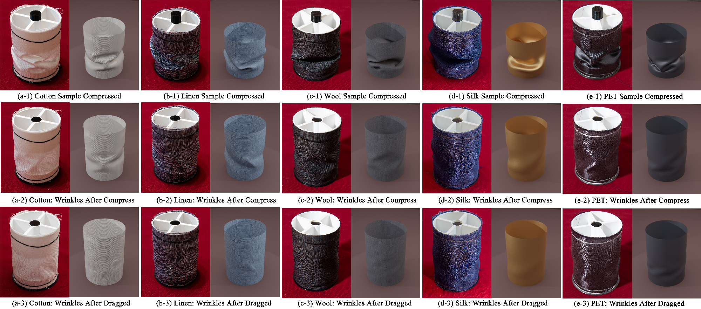

<div align="center">

# Fabric-101 & Learnable Persistent Wrinkles

**A comprehensive fabric dataset and a differentiable cloth simulator for learning persistent wrinkle formation.**

[](https://asia.siggraph.org/2026/)
[](https://doi.org/YOUR_DOI)
[](https://arxiv.org/abs/2609.13707)
[](LICENSE)
[](#data--code-release)



*Real (left) vs. simulated (right) persistent wrinkles on different fabrics. Our differentiable simulator learns fabric-specific friction and plasticity from measured hysteresis curves.*

</div>

---

## Overview

Persistent wrinkles are everywhere in real garments, yet they remain one of the hardest phenomena to reproduce in cloth simulation. Existing methods either rely on hand-tuned parameters or lack the data needed to drive physically meaningful models.

This repository hosts the official implementation of our SIGGRAPH Asia 2026 paper:

> **Learnable Persistent Wrinkle Formation in Cloth Simulation**
> Deshan Gong, Ningtao Mao, Xiaoyuan Yang, Xinyu Lu, He Wang, Taku Komura

We make two contributions:

| | Contribution | Description |
|---|---|---|
| 1 | **Fabric-101** | The first inclusive, accurate, extendable, and open-source fabric dataset for persistent wrinkle simulation — 101 fabrics + 4 papers, spanning diverse fibers, weaves, and post-processing treatments. |
| 2 | **Differentiable Simulator** | The first differentiable cloth simulator that jointly models internal friction and elasto-plasticity, learning fabric parameters directly from measured hysteresis curves. |

---

## Highlights

- **Learnable from data** — No manual parameter tuning. Our adjoint-based optimizer fits fabric parameters directly to cyclic loading–unloading curves.
- **Friction + plasticity** — The first differentiable simulator to jointly model both, capturing the full spectrum from soft recoverable folds to sharp permanent creases.
- **Generalizes across geometries** — Parameters learned from small cylindrical samples transfer to full garments and to Cusick drape.
- **Validated on real fabrics** — Cotton, linen, wool, silk, PET, and even paper.
- **Fully open-source (coming soon)** — The complete dataset and simulator code will be released publicly.

---

## Data & Code Release

> **Coming Soon.**
>
> The Fabric-101 dataset and the differentiable simulator are currently being prepared for public release. They will be made available in this repository together with full documentation.
>
> Watch this repository to get notified when they go live.

<!--
============================================================
  UNCOMMENT THE FOLLOWING BLOCKS ONCE DATA & CODE ARE RELEASED
============================================================

### Explore the dataset

```python
from dataset import Fabric101

ds = Fabric101(root="dataset/")
print(ds.summary())
# >>> 101 fabrics | 4 papers | 6 fiber categories
# >>> Cotton(38) Linen(6) Wool(10) Silk(16) Synthetic(24) Others(10)

curves = ds.load_curves("Cotton", direction="warp")